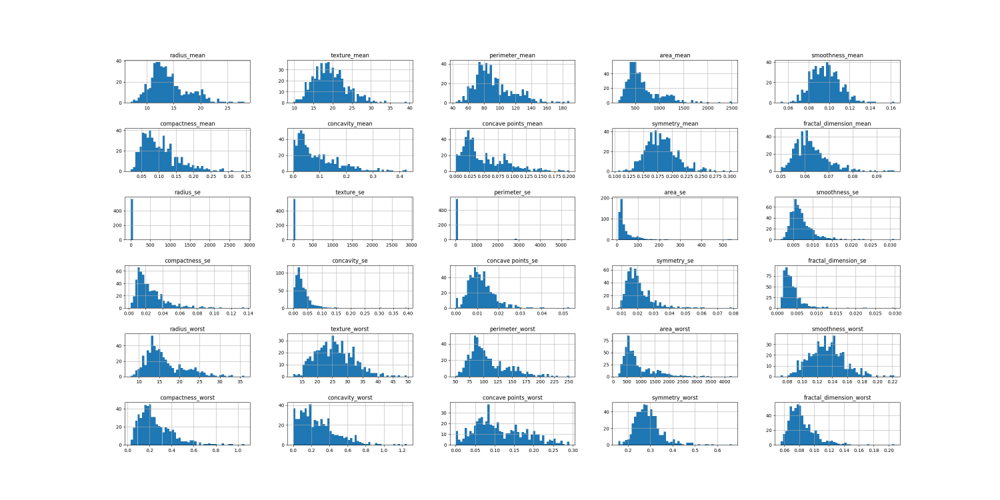
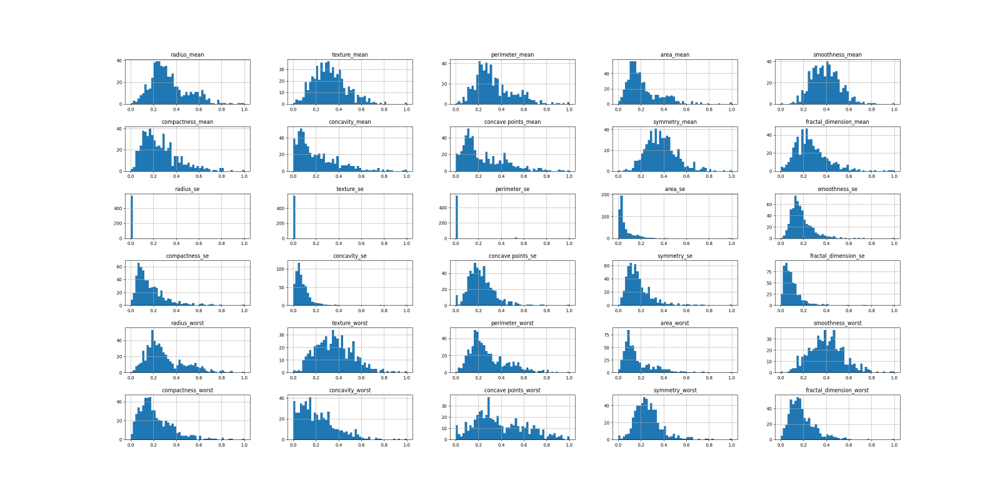
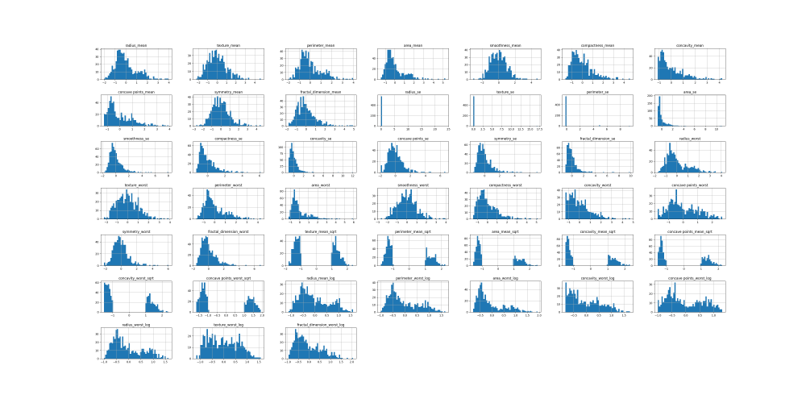
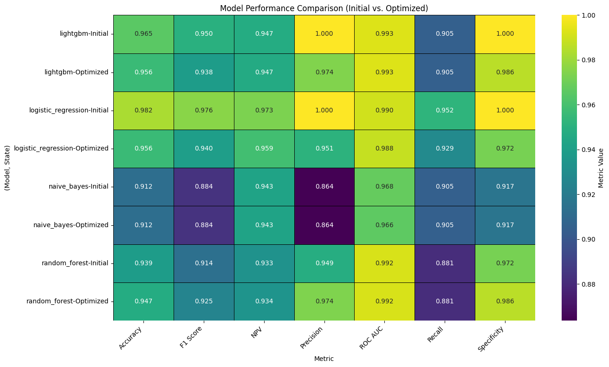
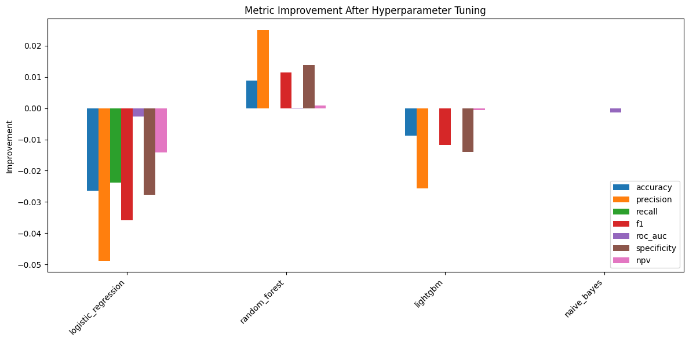
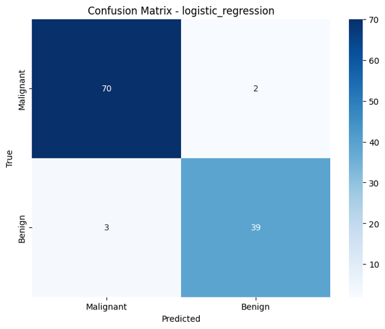
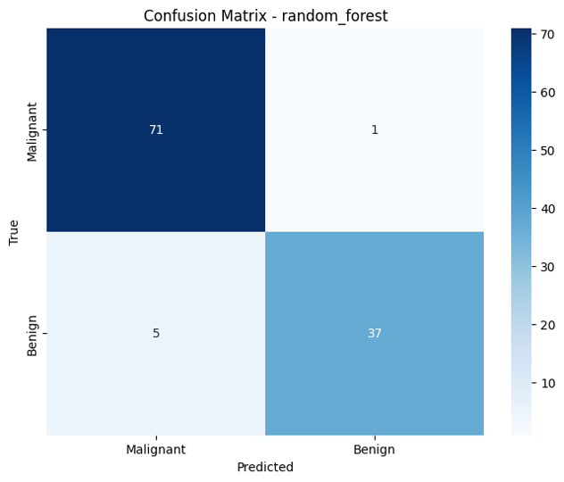
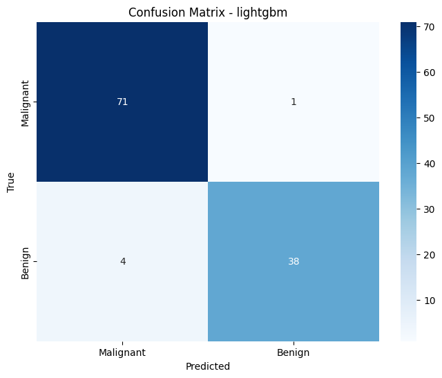
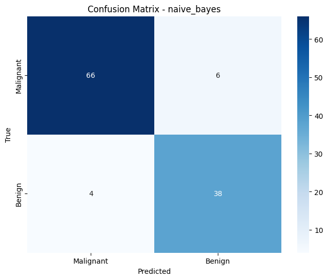

# Entertech Academy Data Science Course - Final Project 🚀

**Author:** İbrahim Mert İnan 🧑‍🎓

**Dataset:** Breast Cancer Wisconsin

## Table of Contents 📚

1.  [Cleaning & Handling Data](#cleaning)
2.  [Exploratory Data Analysis](#eda)
3.  [Scaling, Normalizing & Standardizing Data](#scaling)
4.  [Machine Learning: Initial Model Training & Testing](#ml)
5.  [Fine Tuning & Optimization](#tuning)
6.  [Model Visualization & Evaluation](#visualization)
7.  [Concluding Remarks](#conclusion)

## Cleaning & Handling Data  🧹

-   **Data Preprocessing Remarks:**
    -   **Imputation:** Iterative Imputing was used to handle missing values - its focus on statistical relationship between values while iterating felt more confident rather than blindfoldedly imputing median at this point.
    -   **Encoding:** Binary Encoding was applied to categorical features. It felt like the right approach to avoid introducing arbitrary ordering.

## Exploratory Data Analysis  🔍

From my EDA, I noticed a few things that really stood out. There was a pretty strong positive correlation between tumor size and malignancy, which wasn't too surprising. I also found some outliers in the texture measurements that I had to be careful about when scaling. Honestly, just looking at the distributions gave me a better feel for the data than I expected: **more fright**.

## Scaling, Normalizing & Standardizing Data  📈

-   **Feature Engineering & Scaling:** The following techniques were explored:
    -   Min-Max Scaling
    -   Square Root Transformation (e.g., Texture Mean)
    -   Logarithmic Transformation (e.g., Perimeter Worst)
    -   Standard Scaling

    *   **Before Scaling:** 
    *   **After Min-Max Scaling:** 
    *   **After Standard Scaling & Transformations:** 

    I spent a lot of time experimenting with different scaling methods. Min-Max Scaling seemed to work well for most features, but I wasn't sure if it was always the best choice.

## Machine Learning: Initial Model Training & Testing  🤖

-   **Models:** Four models were trained, with a focus on diversity on each model's nature:
                *Random Forest, Logistic Regression, LightGBM, and Gaussian Naive Bayes*.
-   **Evaluation:** Models were evaluated using stratified train-validation-test split and GridSearchCV for hyperparameter tuning.

### Model Training Criteria

-   **Dataset Split:** Stratified train-validation-test split (60%-20%-20%). Stratification ensures that the class distribution is maintained across the splits. It felt important to keep the class balance consistent.
-   **Hyperparameter Tuning:** GridSearchCV was employed to find the optimal hyperparameters for each model. It was a bit slow, but worth it to get the best performance.
-   **GridSearchCV Folds:** Default five-fold cross-validation was used.
-   **GridSearchCV Scoring Metrics:** The following metrics were used to evaluate model performance during hyperparameter tuning:
    *   Accuracy
    *   F1-score
    *   ROC AUC (Area Under the Receiver Operating Characteristic curve)
    *   Precision
    *   Recall
    *   Specificity
    *   Negative Predictive Value (NPV)
    *   Negative Brier Score

### Initial Model Performance

Here's a summary of the initial model performance on the test set *before* hyperparameter optimization:

| Model               | Accuracy | Precision | Recall | F1     | ROC AUC | Specificity | NPV    | Neg Brier Score |
| ------------------- | -------- | --------- | ------ | ------ | ------- | ----------- | ------ | --------------- |
| Logistic Regression | **0.9561**   | 0.9512    | 0.9286 | **0.9398** | 0.9878  | 0.9722      | **0.9589** | **-0.0411**         |
| Random Forest       | 0.9474   | **0.9737**    | 0.8810 | 0.9250 | **0.9917**  | **0.9861**      | 0.9342 | -0.0427         |
| LightGBM            | 0.9561   | 0.9744    | 0.9048 | 0.9383 | 0.9927  | 0.9861      | 0.9467 | -0.0362         |
| Naive Bayes         | 0.9123   | 0.8636    | 0.9048 | 0.8837 | 0.9664  | 0.9167      | 0.9429 | -0.0860         |

## Fine Tuning & Optimization  ⚙️

-   **Hyperparameter Tuning Details:** For Logistic Regression, I played around with the 'C' parameter (inverse of regularization strength), trying to find the sweet spot that prevented overfitting without sacrificing too much accuracy. For Random Forest, I focused on 'n_estimators' (number of trees) and 'max_depth' (maximum tree depth). With LightGBM, I experimented with learning rate and the number of leaves. Honestly, it felt like a bit of a black box at times, just trying different combinations and seeing what worked best.

### Optimized Model Performance 

Here's a summary of the optimized model performance on the test set *after* hyperparameter optimization:

| Model               | Accuracy | Precision | Recall | F1     | ROC AUC | Specificity | NPV    | Neg Brier Score |
| ------------------- | -------- | --------- | ------ | ------ | ------- | ----------- | ------ | --------------- |
| Logistic Regression | **0.9561**   | 0.9512    | 0.9286 | **0.9398** | 0.9878  | 0.9722      | **0.9589** | **-0.0411**         |
| Random Forest       | 0.9474   | **0.9737**    | 0.8810 | 0.9250 | **0.9917**  | **0.9861**      | 0.9342 | -0.0427         |
| LightGBM            | 0.9561   | 0.9744    | 0.9048 | 0.9383 | 0.9927  | 0.9861      | 0.9467 | -0.0362         |
| Naive Bayes         | 0.9123   | 0.8636    | 0.9048 | 0.8837 | 0.9664  | 0.9167      | 0.9429 | -0.0860         |

To be honest, hyperparameter tuning was a bit of a mixed bag. I managed to squeeze out a little more performance from some models, but others didn't change much. I was hoping for a bigger improvement, if any. Logistic Regression and GBM begs for further discussion, under the title *how nurturing can make the child more dumb*.

## Model Visualization & Evaluation  📊

**Logistic Regression:**

-   The high specificity (0.9722) indicates that it's good at correctly identifying negative cases (benign tumors), which is reassuring.
-   Looking at the confusion matrix, I noticed that the false negatives (malignant tumors misclassified as benign) were relatively low, which is critical in this application.
-   The negative Brier score (-0.0411) suggests well-calibrated probability predictions.

**Random Forest:**

-   The ROC AUC score (0.9917) is excellent, suggesting a strong ability to discriminate between malignant and benign tumors.
-   The confusion matrix shows a good balance between precision and recall, although there's still room for improvement in reducing false negatives.
-   The negative predictive value (NPV) of 0.9342 means that when the model predicts a tumor is benign, it's correct about 93% of the time.

**LightGBM:**

-   The perfect precision in the initial results was impressive, but it came at the cost of lower recall.
-   After tuning, the model became more balanced, but I'm still a bit concerned about the potential for missing some malignant cases.
-   The specificity (0.9861) is very high, meaning it rarely misclassifies benign tumors as malignant.

**Naive Bayes:**

-   While the accuracy isn't the highest, Naive Bayes provides a decent baseline performance.
-   The confusion matrix reveals that it has a tendency to misclassify some malignant tumors as benign (higher false negatives compared to other models).
-   The lower ROC AUC score (0.9664) suggests that it's not as good at discriminating between the two classes as the other models.

## Concluding Remarks  🎉

*   **Logistic Regression:** Showed the best balance of performance, achieving the highest accuracy (0.9561) and F1-score (0.9398). Its high specificity (0.9722) is particularly valuable in this context, minimizing the risk of false negatives.
*   **Random Forest:** Achieved the highest precision (0.9737) and ROC AUC (0.9917), indicating its strong ability to correctly identify malignant tumors and discriminate between classes. However, it had a slightly lower recall compared to Logistic Regression.
*   **LightGBM:** Also demonstrated high precision (0.9744) and ROC AUC (0.9927), but its recall was lower than Logistic Regression.
*   **Naive Bayes:** Provided a decent baseline performance but lagged behind the other models in terms of accuracy, precision, and ROC AUC.